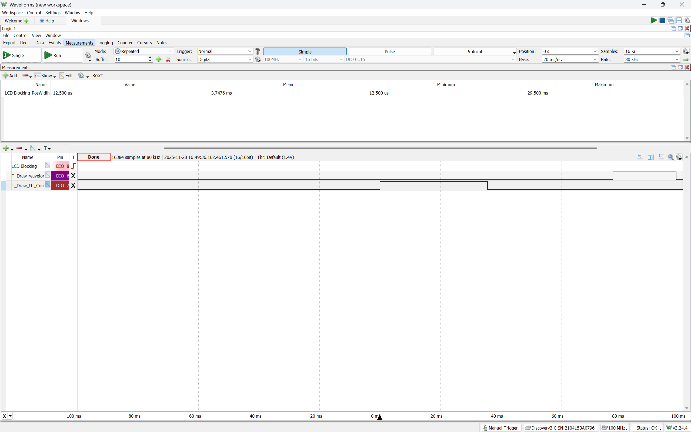
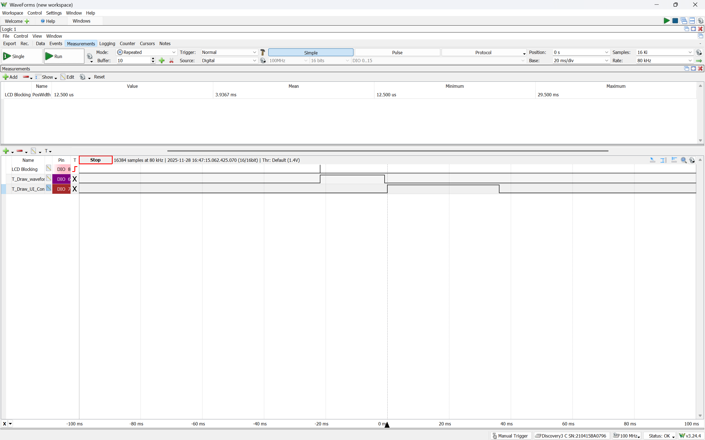
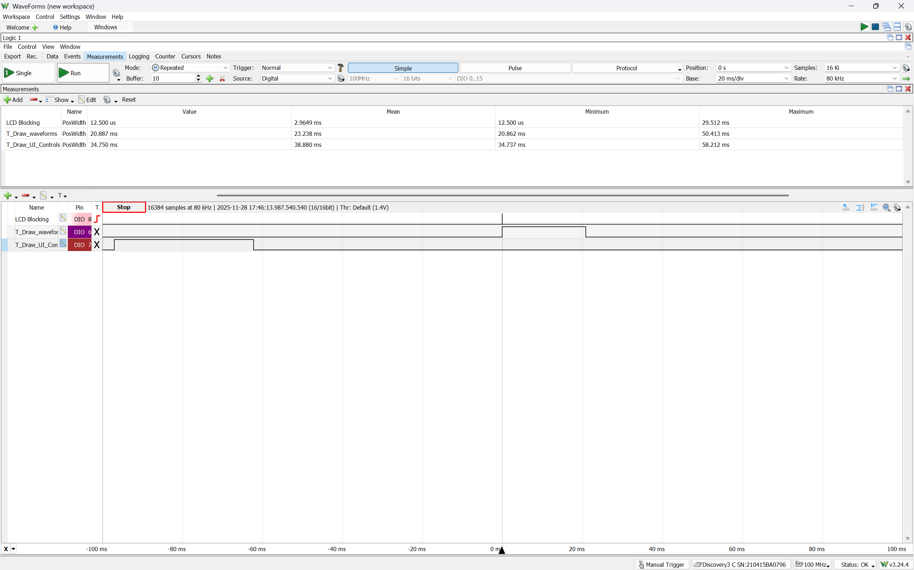

# ECE 460/560 Scope Synchronization Report

**Course:** ECE 460/560 - Embedded System Architectures  
**Project:** ESA 2025 Final Project - Shields Up!  
**Platform:** NXP FRDM-KL25Z (ARM Cortex-M0+) with CMSIS-RTOS2 (RTX5)

---

## Introduction

This report documents the implementation of synchronization between the ADC interrupt service routine (ISR) and the waveform display thread to achieve stable, triggered oscilloscope-like waveform display on the LCD.

### System Components

| Component | Function | Rate |
|-----------|----------|------|
| **ADC0 IRQ Handler** | Executes `Control_HBLED()` for PID control, samples waveform data | ~10.7 kHz |
| **Thread_Draw_Waveforms** | Reads waveform buffers, displays on LCD | Every 100ms |
| **Shared Buffers** | `g_set_sample[960]` and `g_meas_sample[960]` | 960 samples |

### Problem Statement

Without synchronization, the system exhibited:

1. **Data Tearing**: ISR writes to buffer while thread reads, causing corrupted/inconsistent data
2. **Unstable Display**: Waveform appears at random positions with no consistent trigger point
3. **Race Conditions**: Uncoordinated concurrent access to shared buffers

---

## Synchronization Requirements

From the project specification:

1. `Control_HBLED` must **NOT start filling buffers** until setpoint exceeds threshold
2. `Control_HBLED` must **STOP filling buffers** when they are full
3. Thread must **NOT start plotting** until buffers are full
4. `Control_HBLED` must **NOT start filling again** until thread has finished plotting

---

## Solution: State Machine Architecture

A 4-state finite state machine coordinates the ISR and thread:

```
┌─────────┐   trigger    ┌───────────┐   buffer full   ┌──────┐
│  Armed  │ ───────────► │ Triggered │ ──────────────► │ Full │
└─────────┘              └───────────┘                 └──────┘
     ▲                                                     │
     │                   ┌──────────┐   thread starts      │
     └────── done ────── │ Plotting │ ◄────────────────────┘
                         └──────────┘
```

### State Descriptions

| State | ISR Action | Thread Action |
|-------|------------|---------------|
| **Armed** | Monitor setpoint, NOT writing | Poll/wait for Full state |
| **Triggered** | Actively filling buffers (960 samples) | Waiting |
| **Full** | Stop writing, signal thread | Detect Full, transition to Plotting |
| **Plotting** | NOT writing | Read buffers, draw LCD, return to Armed |

### Trigger Condition

The trigger fires when setpoint current crosses threshold from low to high:

```c
#define SCOPE_TRIGGER_THRESHOLD_mA  (1)

if ((prev_set_current_mA < threshold_mA) && (g_set_current_mA >= threshold_mA)) {
    // Trigger! Start capturing
}
```

---

## Implementation Approaches

Two approaches were implemented, selectable via configuration switch:

```c
// In config.h
#define SCOPE_SYNC_WITH_RTOS  (1)  // 0 = Polling, 1 = Event Flags
```

### Approach 1: State Machine (Polling)

**Configuration:** `SCOPE_SYNC_WITH_RTOS (0)`

#### ISR Code (control.c)
```c
switch (g_scope_state) {
    case Armed:
        // Wait for trigger - NOT writing to buffers
        if ((prev_set_current_mA < threshold_mA) && 
            (g_set_current_mA >= threshold_mA)) {
            sample_idx = 0;
            g_scope_state = Triggered;
            g_meas_sample[sample_idx] = res;
            g_set_sample[sample_idx] = g_set_current_code;
            sample_idx++;
        }
        break;
        
    case Triggered:
        // Filling buffers
        g_meas_sample[sample_idx] = res;
        g_set_sample[sample_idx] = g_set_current_code;
        sample_idx++;
        if (sample_idx >= SAM_BUF_SIZE) {
            sample_idx = 0;
            g_scope_state = Full;
        }
        break;
        
    case Full:
    case Plotting:
        // NOT writing - waiting for thread
        break;
}
```

#### Thread Code (threads.c)
```c
if (g_scope_state == Full) {
    g_scope_state = Plotting;
    
    osMutexAcquire(LCD_mutex, osWaitForever);
    UI_Draw_Waveforms();
    osMutexRelease(LCD_mutex);
    
    g_scope_state = Armed;  // Re-arm
}
```

**Characteristics:**
- Synchronization via shared volatile variable
- Thread polls state variable each period
- No RTOS dependency for synchronization
- Simple implementation

---

### Approach 2: RTOS Event Flags

**Configuration:** `SCOPE_SYNC_WITH_RTOS (1)`

#### Event Flag Definitions (control.h)
```c
#define SCOPE_FLAG_BUFFER_FULL    (1U << 0)
extern osEventFlagsId_t scope_event_flags;
```

#### ISR Code (control.c)
```c
case Triggered:
    g_meas_sample[sample_idx] = res;
    g_set_sample[sample_idx] = g_set_current_code;
    sample_idx++;
    if (sample_idx >= SAM_BUF_SIZE) {
        sample_idx = 0;
        g_scope_state = Full;
        osEventFlagsSet(scope_event_flags, SCOPE_FLAG_BUFFER_FULL);
    }
    break;
```

#### Thread Code (threads.c)
```c
uint32_t flags = osEventFlagsWait(scope_event_flags, 
                                   SCOPE_FLAG_BUFFER_FULL,
                                   osFlagsWaitAny, 0);  // Non-blocking

if (flags == SCOPE_FLAG_BUFFER_FULL) {
    g_scope_state = Plotting;
    
    osMutexAcquire(LCD_mutex, osWaitForever);
    UI_Draw_Waveforms();
    osMutexRelease(LCD_mutex);
    
    g_scope_state = Armed;
}
```

#### Initialization (threads.c)
```c
void Create_OS_Objects(void) {
    LCD_Create_OS_Objects();
    
#if SCOPE_SYNC_WITH_RTOS
    scope_event_flags = osEventFlagsNew(NULL);
#endif
    // ... create threads ...
}
```

**Characteristics:**
- ISR signals thread via RTOS event flag
- Event flag auto-clears when read
- Uses CMSIS-RTOS2 API
- More explicit synchronization

---

## Comparison of Approaches

| Feature | Approach 1 (Polling) | Approach 2 (Event Flags) |
|---------|---------------------|-------------------------|
| **Sync mechanism** | Shared volatile variable | RTOS event flags |
| **ISR notification** | Sets `g_scope_state = Full` | `osEventFlagsSet()` |
| **Thread detection** | Polls `g_scope_state` | `osEventFlagsWait()` |
| **RTOS required** | No | Yes |
| **Flag management** | Manual | Auto-clear on read |
| **Portability** | High (any system) | RTOS-dependent |
| **Complexity** | Lower | Slightly higher |
| **ISR-safe** | Yes (just writes variable) | Yes (event flags are ISR-safe) |

---

## Waveform Captures

### Thread Execution Timing

| T_Draw_UI_Controls | T_Draw_Waveforms |
|-------------------|------------------|
|  |  |
| *Thread execution showing LCD mutex acquisition* | *Waveform thread with synchronized buffer access* |

### Execution Time Analysis



*Pulse width measurement showing execution time of both UI and waveform drawing threads*

---

## Timing Analysis

### Buffer Fill Time
- **Samples:** 960
- **ISR Rate:** ~10.7 kHz
- **Fill Time:** 960 / 10,700 ≈ **90 ms**

### Thread Period
- **THREAD_DRAW_WAVEFORM_PERIOD_TICKS:** 100ms

### Synchronization Latency
- **Maximum delay from Full to Plotting:** ~100ms (one thread period)

### Update Rate
- Waveform updates approximately every flash period (when trigger fires)

---

## Results

### Before Synchronization
- Waveform jumps randomly on display
- No consistent trigger point
- Data may be corrupted (torn reads)
- Analysis of control response impossible

### After Synchronization
- **Stable display** - waveform stays in fixed position
- **Consistent trigger** - rising edge always at left edge
- **Complete data** - no torn reads or corruption
- **Coherent traces** - setpoint and measured current align properly

---

## Files Modified

| File | Changes |
|------|---------|
| `config.h` | Added `SCOPE_SYNC_WITH_RTOS` configuration switch |
| `control.h` | Added `SCOPE_STATE_E` enum, event flag declarations |
| `control.c` | Implemented state machine in `Control_HBLED()` |
| `threads.c` | Added event flag initialization, synchronization in `Thread_Draw_Waveforms()` |

---

## Configuration

To switch between approaches, modify `config.h`:

```c
// Scope Synchronization Configuration
// Set to 1 to use RTOS mechanisms (event flags) for ISR-Thread synchronization
// Set to 0 to use state machine approach (polling without RTOS mechanisms)
#define SCOPE_SYNC_WITH_RTOS  (1)
```

---

## Conclusion

Both synchronization approaches successfully solve the data tearing and display stability problems. The state machine approach is simpler and more portable, while the event flags approach provides more explicit RTOS-based synchronization. The choice depends on system requirements:

- **Use Approach 1 (Polling)** when RTOS independence is important
- **Use Approach 2 (Event Flags)** when using RTOS and want explicit synchronization primitives

The implemented solution ensures mutually exclusive access to shared waveform buffers, providing a stable, triggered oscilloscope-like display for analyzing the LED control system behavior.
